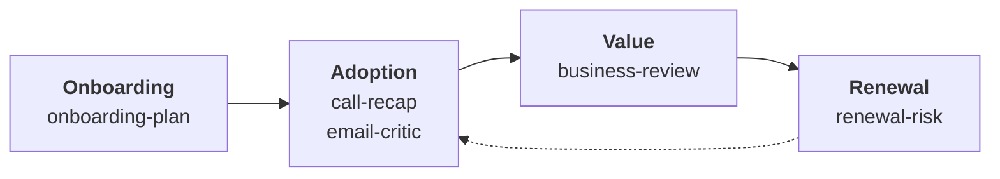

# Customer Success Skills

**Open resource hub for Customer Success teams - and the business units that sit next to them.**

A growing library of AI skills for the work customer success actually does: reading renewal risk, running business reviews, planning onboarding, turning calls into follow-ups, and stress-testing an email before it goes out.

These are working skills rather than demos. Each one is built around a job that keeps repeating, states what it needs to run, and says what it could not check rather than guessing.

Maintained by [CS Pulse](https://cspulse.com), a community for customer success practitioners.

---

## Start here

| Skill | The job it does |
| :--- | :--- |
| [`account-context`](skills/account-context) | Captures the shared context every other skill needs, once, so they stop asking for it. What the product does in the customer's words, how the segments differ, contract shapes, the value metric, and what healthy usage looks like in this business. Run it first. Every other skill uses it where present and names the assumption where absent. |

Without it, a renewal read can tell you usage is down. With it, the same read knows that in your business a flat usage line is what a healthy compliance deployment looks like.

---

## The skills, by where they sit in the account lifecycle



| Skill | The job it does |
| :--- | :--- |
| [`onboarding-plan`](skills/onboarding-plan) | Builds a first-90-days plan aimed at a result the customer can name, not a checklist your team can close. Success criteria carry a baseline, and it covers the three reasons a customer refuses to commit to one. |
| [`call-recap`](skills/call-recap) | Turns a call into an honest read of how it went plus every follow-up email it generated, grouped by recipient and staged as drafts. Works with any meeting recorder, or a pasted transcript. |
| [`email-critic`](skills/email-critic) | Stress-tests a drafted customer email against the transcript and account context, then returns a verdict and a tightened version. Checks facts before prose, because that is where the damage is. |
| [`business-review`](skills/business-review) | Prepares a QBR or EBR that earns the next meeting: the customer's business first, value proved to a standard finance would accept, an explicit ask. Tells you when a business review is the wrong meeting to run. |
| [`renewal-risk`](skills/renewal-risk) | Produces a defensible read on whether an account will renew - the decision, the decider, the mechanism, the dollars and the play. Built on the principle that usage describes the user while the renewal is decided by the buyer. |

---

## Install

### Claude Cowork or the Claude app

No terminal required. Download a skill's folder, zip it, then go to **Customize > Skills**, click **+**, choose **Create skill** and then **Upload a skill**. The folder name inside the zip must match the skill's `name` in its frontmatter.

See [Using skills in Claude](https://support.claude.com/en/articles/12512180-using-skills-in-claude).

### Claude Code

```
/plugin marketplace add CSPulse/customer-success-skills
/plugin install cs-skills@cspulse-skills
```

### Claude API

Follow the [Skills quickstart](https://docs.claude.com/en/api/skills-guide#creating-a-skill).

### By hand

Copy any skill folder into `~/.claude/skills/<skill-name>/` for all your projects, or `.claude/skills/<skill-name>/` inside one.

---

## They work without any setup

You do not need a workspace, connectors, or file access. Every skill opens with a **What this needs** section stating the least you can have and still get value - usually just what you paste into the chat.

| Skill | Works with nothing but | Gets better with |
| :--- | :--- | :--- |
| `account-context` | five minutes and what you already know | the pricing page, a sample contract, an original business case |
| `renewal-risk` | what you know about the account | usage data, mailbox history, the account plan |
| `business-review` | the account and the date | their stated goals, outcome data, the attendee list |
| `onboarding-plan` | what was sold and to whom | the sales handover, contract scope, stakeholder map |
| `call-recap` | a pasted transcript | a meeting recorder, a mailbox, account notes |
| `email-critic` | the draft itself | the transcript, the thread, a voice guide |

Missing context never blocks a skill. It changes what the skill can honestly claim, and each one names the checks it could not run rather than guessing around the gap.

---

## Where the thinking comes from

These are built on published customer success practice rather than invented from scratch, including work on renewal forecasting and risk escalation, lifecycle and value-realisation models, success-milestone and desired-outcome framing, and buyer-side research on what makes business reviews fail. Where the field disagrees - on whether adoption or outcome is the right objective, on whether quarterly is the right cadence - the skills say so instead of picking a side silently.

Vendor statistics are deliberately absent. A great deal of widely-circulated customer success data traces back to marketing with no primary study behind it, so these skills are built on mechanisms rather than numbers.

---

## Contributing

This is meant to be a hub, not a monologue. If you run customer success and a skill gets something wrong, that is the most useful contribution there is.

- **A skill is wrong or thin** - open an issue saying what happens in reality
- **A skill is missing** - open an issue describing the job, when it recurs, and what a good output looks like
- **You have written one** - open a pull request. [`template/SKILL.md`](template/SKILL.md) is the starting structure

Two rules for anything added here: nothing may be a prerequisite, so every skill must run with no workspace and no connectors; and every skill states the failure it exists to prevent.

---

## License

MIT. See [LICENSE](LICENSE).
