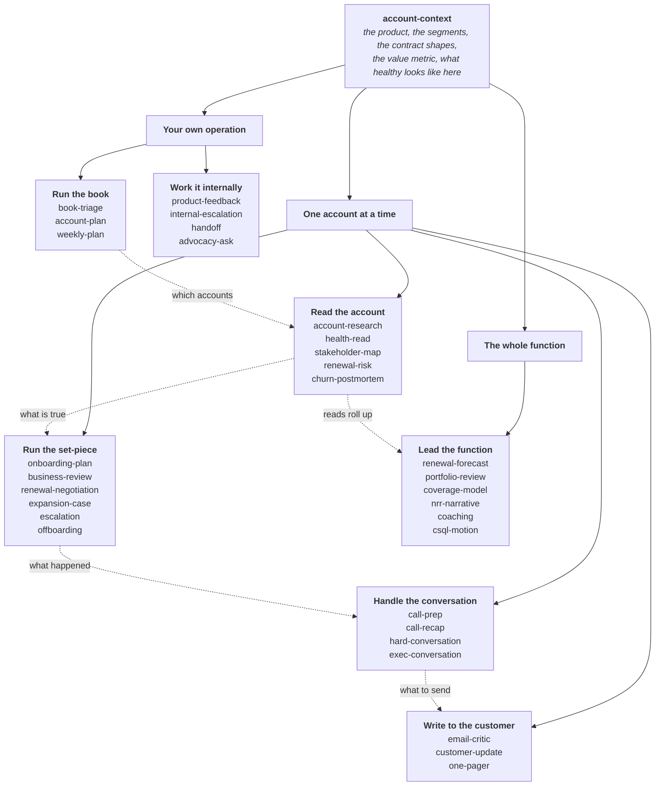

# Customer Success Skills

**An open library of AI skills for the work customer success actually does.**

Reading an account honestly. Running the set-piece moments. Handling the conversations. Writing the things customers actually read.

Thirty-two skills today, grouped into seven categories and built out over time. The full list is below.

These are working skills, not demos. Each one is built around a job that keeps repeating, states the least it needs to run, and says what it could not check rather than guessing.

Maintained by [CS Pulse](https://cspulse.com?ref=github), a community for customer success practitioners. Free, MIT licensed, and built to be forked and argued with.

---

## What is a skill?

A skill is a set of instructions you give an AI assistant so it does a specific job properly, instead of doing a generic version of it.

Without one, asking an assistant to "assess renewal risk on this account" gets you a plausible paragraph that could be about any account in any company. With one, it works through the decision, the decider, the mechanism and the dollars, tells you which of its evidence is inference rather than fact, and names what it could not check.

**You do not need to be technical.** A skill is a markdown file. Installing one is uploading a folder. Nothing here needs a terminal, a workspace, a connector or an API key, and most of it runs on what you paste into a chat window.

---

## How these work together

One skill sits underneath all the others. `account-context` captures what your product does, how your segments differ, how your contracts are shaped, and what healthy usage looks like **in your business**. Every other skill reads it.

That is the difference between a library and a pile. Without it, a renewal read can tell you usage is down. With it, the same read knows that in your business a flat usage line is what a healthy compliance deployment looks like.



All seven categories are complete. The library is the full map rather than a work in progress, and what happens next is testing rather than adding. The other three are listed further down.

Skills read it where it exists and name the assumption where it does not. It is context, never a prerequisite.

---

## The skills

<!-- SKILLS:START -->

| Skill | The job it does |
| :--- | :--- |
| [`account-context`](skills/account-context) | Captures the shared context every other skill needs, once, so they stop asking for it. Run this first. |
| [`onboarding-plan`](skills/onboarding-plan) | Builds a first-90-days plan aimed at a result the customer can name, not a checklist your team can close. Success criteria carry a baseline, and it covers the three reasons a customer refuses to commit to one. |
| [`renewal-forecast`](skills/renewal-forecast) | A forecast in dollars with contraction on its own line, evidence-based entry criteria per category, and correlated risks grouped by mechanism and forecast as one bet rather than thirty. |
| [`portfolio-review`](skills/portfolio-review) | Reviews your team's reads rather than their accounts. Samples rather than covers, always includes a random five, and asks the four questions that expose a read with no mechanism behind it. |
| [`coverage-model`](skills/coverage-model) | Who gets a named CSM, who gets pooled, who gets digital only, and what breaks at each line. The ratio is an output of cost to serve, and the model is tested against the accounts that actually churned. |
| [`nrr-narrative`](skills/nrr-narrative) | Decomposes retention into expansion, price, contraction and churn before narrating it, keeps gross next to net, and names what the number hides before a board asks. |
| [`coaching`](skills/coaching) | Diagnoses skill, knowledge, will or environment before coaching anything, works one observable behaviour at a time, asks for the self-assessment first, and rehearses rather than advises. |
| [`csql-motion`](skills/csql-motion) | Expansion signals from CS to sales without burning the relationship that produced them. One badly handled handoff ends the flow of signals within a month, so the handoff design is the programme. |
| [`book-triage`](skills/book-triage) | Decides which accounts get your attention this week and writes down which ones deliberately do not. Sorts by what changed and what can still be influenced, not by size or health colour, and always includes one account nobody has heard from. |
| [`account-plan`](skills/account-plan) | The durable per-account plan, written for whoever inherits it in month four. Objectives in the customer's words with a baseline, owners on both sides, and every risk carrying a trigger rather than a worry. |
| [`weekly-plan`](skills/weekly-plan) | Shapes the week around what has to be true by Friday rather than around the calendar that filled itself. Protects one block for the work that has no deadline, because proactive work loses every collision it will ever have. |
| [`product-feedback`](skills/product-feedback) | Turns customer noise into something product will act on: the job to be done rather than the requested feature, how many accounts share it, and what happens if nothing changes, said honestly. Closes the loop back, including on a no. |
| [`internal-escalation`](skills/internal-escalation) | Gets your own company to act, with the ask written as one sentence carrying a name, an action and a date. Refuses to inflate severity, because the credibility cost is permanent and your colleagues pay it too. |
| [`handoff`](skills/handoff) | Sales to CS, CSM to CSM, CS to support. Forces out the four things that never reach a system, and lets the receiving side decide when it is complete rather than the person leaving. |
| [`advocacy-ask`](skills/advocacy-ask) | References, case studies, reviews. Times the ask to realised value rather than to renewal, asks the person who benefited rather than the one who signed, and tracks who has already been asked by every other team. |
| [`renewal-negotiation`](skills/renewal-negotiation) | Prepares the renewal conversation itself: what you concede, what you will not, the walk-away, and the four asks you are going to get. Built on the rule that every concession is permanent unless you deliberately make it temporary. |
| [`expansion-case`](skills/expansion-case) | Builds the internal business case your champion carries without you in the room, in their words and on one page. Checks first that the existing deployment is demonstrably working, because an expansion ask on a broken one risks the renewal. |
| [`escalation`](skills/escalation) | Runs the first four hours of an account on fire. What to say before you know the answer, who to pull in and when, and what the customer actually wants, which is often a forwardable answer rather than a fix. |
| [`offboarding`](skills/offboarding) | Losing well. The data handover done faster than required, the exit conversation asked for separately so it is honest, and the door left open, because champions move and carry a memory of how it ended. |
| [`call-prep`](skills/call-prep) | Prepares a call around the one thing it has to produce rather than what you plan to say. Names the outcome in a form that can be failed, finds the landmine before the customer raises it, and sets the ask and the fallback ask. |
| [`call-recap`](skills/call-recap) | Turns a call into an honest read of how it went plus every follow-up email it generated, grouped by recipient and staged as drafts. Works with any meeting recorder, or a pasted transcript. |
| [`hard-conversation`](skills/hard-conversation) | Scripts the conversation you are putting off: a price increase, a feature you will not build, a commitment you missed, or a failure that cost them money. Settles what you can offer and on whose authority before a word is said. |
| [`exec-conversation`](skills/exec-conversation) | Prepares fifteen minutes with someone three levels up who has no context and did not ask for the meeting. One ask, one number they recognise, and the two questions only they can answer. |
| [`customer-update`](skills/customer-update) | Writes the proactive message nobody wants to send: an incident, a delay, a deprecation, a price change, a change of CSM. Segments by impact rather than by mailing list, and says plainly whether action is needed. |
| [`one-pager`](skills/one-pager) | Writes the summary a sponsor forwards to their boss without editing it. Their vocabulary, no logo, conclusion in the first three lines, and the covering line written for them. |
| [`email-critic`](skills/email-critic) | Stress-tests a drafted customer email against the transcript and account context, then returns a verdict and a tightened version. Checks facts before prose, because that is where the damage is. |
| [`business-review`](skills/business-review) | Prepares a QBR or EBR that earns the next meeting: the customer's business first, value proved to a standard finance would accept, an explicit ask. Tells you when a business review is the wrong meeting to run. |
| [`account-research`](skills/account-research) | Archaeology on an account you inherited: what was sold, by whom, on what promise, and which of it nobody has questioned since. Marks every claim as documented, reported or folklore, and ends with the questions it could not answer. |
| [`health-read`](skills/health-read) | Audits an account health score instead of reporting it. Separates what is measured from what is inferred, finds the inputs that are proxies, and asks whether the score has ever been tested against accounts that actually left. |
| [`stakeholder-map`](skills/stakeholder-map) | Maps who decides an account's outcome by what they can do to it rather than by job title. Flags who has never actually been met, tests for single-threading, and tracks who went quiet. |
| [`churn-postmortem`](skills/churn-postmortem) | Works out why an account actually left, separating the reason given from the mechanism. Keeps what was detectable at the time apart from what is only obvious in hindsight, and checks whether the loss was one of a correlated set. |
| [`renewal-risk`](skills/renewal-risk) | Produces a defensible read on whether an account will renew: the decision, the decider, the mechanism, the dollars and the play. Built on the principle that usage describes the user while the renewal is decided by the buyer. |

<!-- SKILLS:END -->

---

## Where this is going

Seven categories, all built. Thirty-two skills. If one you need is missing, [say so](../../issues/new/choose).

| Category | Built | Planned |
| :--- | :--- | :--- |
| **Read the account** | `account-research` · `health-read` · `stakeholder-map` · `renewal-risk` · `churn-postmortem` | *Complete* |
| **Run the set-piece** | `onboarding-plan` · `business-review` · `renewal-negotiation` · `expansion-case` · `escalation` · `offboarding` | *Complete* |
| **Handle the conversation** | `call-prep` · `call-recap` · `hard-conversation` · `exec-conversation` | *Complete* |
| **Write to the customer** | `email-critic` · `customer-update` · `one-pager` | *Complete* |
| **Work it internally** | `product-feedback` · `internal-escalation` · `handoff` · `advocacy-ask` | *Complete* |
| **Run the book** | `book-triage` · `account-plan` · `weekly-plan` | *Complete* |
| **Lead the function** | `renewal-forecast` · `portfolio-review` · `coverage-model` · `nrr-narrative` · `coaching` · `csql-motion` | *Complete* |

Grouped by the job in front of you rather than by lifecycle stage, because nobody thinks "I am in the adoption phase". They think "I have a call in an hour".

---

## Install

### The easy way: one paste

If your AI tool can read and write files on your computer (Claude Cowork, Claude Code, or similar), paste this in and let it do the rest:

```
I want to install skills from https://github.com/CSPulse/customer-success-skills. Download or clone the repository, then copy the skill folders I want into ~/.claude/skills/ (or .claude/skills/ if this is for one project only), one folder per skill, keeping each folder's own name. Ask me which skills I want if I have not said, and tell me the exact folder path each one landed in when you are done.
```

If you only want one or two skills, name them. If your AI tool cannot read or write files on its own, which is most web chat, use one of the manual methods below instead.

### In the Claude app, no terminal needed

1. Download this repository as a ZIP, or clone it
2. Zip a single skill's folder from `skills/`, on its own
3. In Claude, go to **Customize**, then **Skills**, then **Create skill**, then **Upload a skill**
4. Upload the ZIP

The folder name inside the ZIP must match the skill's `name` in its frontmatter. See [Using skills in Claude](https://support.claude.com/en/articles/12512180-using-skills-in-claude).

### As a plugin, in Claude Code or Cowork

```
/plugin marketplace add CSPulse/customer-success-skills
/plugin install customer-success-skills@cspulse
```

### By hand

Copy any skill folder into `~/.claude/skills/<skill-name>/` to have it everywhere, or `.claude/skills/<skill-name>/` inside a single project.

### Claude API

Follow the [Skills quickstart](https://docs.claude.com/en/api/skills-guide#creating-a-skill).

### Or just read them

Every skill is plain markdown. `skills/<name>/SKILL.md` is the method, and anything in `assets/` is a template you can copy into a document without an assistant involved at all.

---

## Using them

Once installed, you do not call a skill by name. You describe the job and the right one triggers.

> **"Will Northwind renew? Their date is in eleven weeks."**
> Runs `renewal-risk`. Comes back with the call, the decider, the mechanism, a dollar range, what would make the read wrong, and what it could not check.

> **"I have a QBR with the Contoso team on Thursday, help me build it."**
> Runs `business-review`. Starts by asking what the customer needs to walk away believing, and tells you if a business review is the wrong meeting to run.

> **"Here's the transcript from my call this morning."**
> Runs `call-recap`. Returns the honest read plus every follow-up email the call generated, grouped by who receives it.

> **"I have to tell them we are raising their price and I have been putting it off."**
> Runs `hard-conversation`. Works out what you can offer and on whose authority before a word is said, writes the opening two sentences, and sets the walk-away in advance so you do not improvise a concession you cannot retract.

> **"They want 20% off and procurement just joined the thread."**
> Runs `renewal-negotiation`. Works out what their real alternative is rather than the one they described, builds a concession ladder where every rung has a price, and finds the win procurement can take that is not your margin.

> **"Set up account context."**
> Runs `account-context`. Interviews you once, then writes the document the others read.

You can also name one directly if you prefer: *"use renewal-risk on this account"*.

---

## They work without any setup

You do not need a workspace, connectors or file access. Every skill opens with a **What this needs** section stating the least you can have and still get value.

| Skill | Works with nothing but | Gets better with |
| :--- | :--- | :--- |
| `account-context` | five minutes and what you already know | the pricing page, a sample contract, an original business case |
| `account-research` | the account name and whatever you were handed | the original deal notes, the mailbox, twenty minutes with whoever had it before |
| `health-read` | the score and roughly what goes into it | the input values, the trend, and what churned accounts scored |
| `stakeholder-map` | the names you know | email and meeting history, the original deal notes |
| `churn-postmortem` | what you remember | the account history, the support record, the original business case |
| `renewal-risk` | what you know about the account | usage data, mailbox history, the account plan |
| `business-review` | the account and the date | their stated goals, outcome data, the attendee list |
| `onboarding-plan` | what was sold and to whom | the sales handover, contract scope, stakeholder map |
| `renewal-forecast` | the accounts up for renewal, their values and dates | a risk read per account, and last quarter's forecast against actual |
| `portfolio-review` | your team's current reads | last contact dates, and forecast-versus-actual history per person |
| `coverage-model` | the account list with values, and your headcount | churn history by segment, usage data, support load per account |
| `nrr-narrative` | the retention numbers and the period | the movement split four ways, and cohort or segment data |
| `coaching` | something you observed yourself | the recording or artefact, and a pattern across several observations |
| `csql-motion` | what you want CS to spot and who would work it | historical expansion data, and both teams' compensation plans |
| `book-triage` | your account list with renewal dates and rough values | usage trend, support activity, and last real contact dates |
| `account-plan` | the account, its contract, and what you know of their goals | the original business case, outcome data, a stakeholder map |
| `weekly-plan` | your calendar and a sense of what is urgent | a triage list, and an honest record of where last week went |
| `product-feedback` | what the customer asked for and who they are | other accounts raising it, usage data, your product team's intake format |
| `internal-escalation` | what you need and by when | the contract value, what you have already tried, your company's escalation process |
| `handoff` | the account and both names | the account history, open commitments, thirty minutes of live overlap |
| `advocacy-ask` | the account and what is being asked for | open escalations, and a record of what they have already been asked |
| `renewal-negotiation` | the account, the date and roughly what they pay | the contract, especially notice date and uplift clause |
| `expansion-case` | what you want to expand into and who would sponsor it | outcome data from the existing deployment, a stakeholder map |
| `escalation` | what happened and who is angry | the incident record, the contract, a stakeholder map |
| `offboarding` | the account and the end date | the contract, the account history, the original business case |
| `call-prep` | who you are meeting and why | the last recap, recent email history, a stakeholder map |
| `call-recap` | a pasted transcript | a meeting recorder, a mailbox, account notes |
| `hard-conversation` | what happened and who it affects | the commitment as it was actually made in writing, the contract |
| `exec-conversation` | their title and why the meeting exists | ten minutes with the champion, outcome data in their measure |
| `customer-update` | what is changing, when, and who it touches | the account list with contract detail, any notice obligation |
| `one-pager` | what happened and who it is for | their goals in their words, a prior document their leadership has seen |
| `email-critic` | the draft itself | the transcript, the thread, a voice guide |

Missing context never blocks a skill. It changes what the skill can honestly claim, and each one names the checks it could not run rather than guessing around the gap.

---

## Where the thinking comes from

These are built on published customer success practice rather than invented from scratch, including work on renewal forecasting and risk escalation, lifecycle and value-realisation models, success-milestone and desired-outcome framing, and buyer-side research on what makes business reviews fail. Where the field disagrees, on whether adoption or outcome is the right objective, or whether quarterly is the right cadence, the skills say so instead of picking a side silently.

Vendor statistics are deliberately absent. A great deal of widely-circulated customer success data traces back to marketing with no primary study behind it, so these skills are built on mechanisms rather than numbers.

---

## Contributing

This is meant to be a hub, not a monologue. If you run customer success and a skill gets something wrong, that is the most useful thing you can tell us.

See [CONTRIBUTING.md](CONTRIBUTING.md), or go straight to [opening an issue](../../issues/new/choose).

---

## License

MIT. See [LICENSE](LICENSE).
