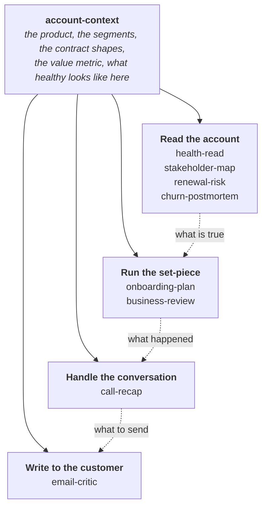

# Customer Success Skills

**An open library of AI skills for the work customer success actually does.**

Reading an account honestly. Running the set-piece moments. Handling the conversations. Writing the things customers actually read.

Nine skills today, grouped into seven categories and built out over time. The full list is below.

These are working skills, not demos. Each one is built around a job that keeps repeating, states the least it needs to run, and says what it could not check rather than guessing.

Maintained by [CS Pulse](https://cspulse.com), a community for customer success practitioners. Free, MIT licensed, and built to be forked and argued with.

---

## What is a skill?

A skill is a set of instructions you give an AI assistant so it does a specific job properly, instead of doing a generic version of it.

Without one, asking an assistant to "assess renewal risk on this account" gets you a plausible paragraph that could be about any account in any company. With one, it works through the decision, the decider, the mechanism and the dollars, tells you which of its evidence is inference rather than fact, and names what it could not check.

**You do not need to be technical.** A skill is a markdown file. Installing one is uploading a folder. Nothing here needs a terminal, a workspace, a connector or an API key, and most of it runs on what you paste into a chat window.

---

## How these work together

One skill sits underneath all the others. `account-context` captures what your product does, how your segments differ, how your contracts are shaped, and what healthy usage looks like **in your business**. Every other skill reads it.

That is the difference between a library and a pile. Without it, a renewal read can tell you usage is down. With it, the same read knows that in your business a flat usage line is what a healthy compliance deployment looks like.



Four of the seven categories have skills today. The other three are listed further down.

Skills read it where it exists and name the assumption where it does not. It is context, never a prerequisite.

---

## The skills

<!-- SKILLS:START -->

| Skill | The job it does |
| :--- | :--- |
| [`account-context`](skills/account-context) | Captures the shared context every other skill needs, once, so they stop asking for it. Run this first. |
| [`onboarding-plan`](skills/onboarding-plan) | Builds a first-90-days plan aimed at a result the customer can name, not a checklist your team can close. Success criteria carry a baseline, and it covers the three reasons a customer refuses to commit to one. |
| [`call-recap`](skills/call-recap) | Turns a call into an honest read of how it went plus every follow-up email it generated, grouped by recipient and staged as drafts. Works with any meeting recorder, or a pasted transcript. |
| [`email-critic`](skills/email-critic) | Stress-tests a drafted customer email against the transcript and account context, then returns a verdict and a tightened version. Checks facts before prose, because that is where the damage is. |
| [`business-review`](skills/business-review) | Prepares a QBR or EBR that earns the next meeting: the customer's business first, value proved to a standard finance would accept, an explicit ask. Tells you when a business review is the wrong meeting to run. |
| [`health-read`](skills/health-read) | Audits an account health score instead of reporting it. Separates what is measured from what is inferred, finds the inputs that are proxies, and asks whether the score has ever been tested against accounts that actually left. |
| [`stakeholder-map`](skills/stakeholder-map) | Maps who decides an account's outcome by what they can do to it rather than by job title. Flags who has never actually been met, tests for single-threading, and tracks who went quiet. |
| [`churn-postmortem`](skills/churn-postmortem) | Works out why an account actually left, separating the reason given from the mechanism. Keeps what was detectable at the time apart from what is only obvious in hindsight, and checks whether the loss was one of a correlated set. |
| [`renewal-risk`](skills/renewal-risk) | Produces a defensible read on whether an account will renew: the decision, the decider, the mechanism, the dollars and the play. Built on the principle that usage describes the user while the renewal is decided by the buyer. |

<!-- SKILLS:END -->

---

## Where this is going

Seven categories, built out over time. Six skills exist today and the rest are planned. If one you need is missing, [say so](../../issues/new/choose).

| Category | Built | Planned |
| :--- | :--- | :--- |
| **Read the account** | `health-read` · `stakeholder-map` · `renewal-risk` · `churn-postmortem` | `account-research` |
| **Run the set-piece** | `onboarding-plan` · `business-review` | `renewal-negotiation` · `expansion-case` · `escalation` · `offboarding` |
| **Handle the conversation** | `call-recap` | `call-prep` · `hard-conversation` · `exec-conversation` |
| **Write to the customer** | `email-critic` | `customer-update` · `one-pager` |
| **Work it internally** | | `product-feedback` · `internal-escalation` · `handoff` · `advocacy-ask` |
| **Run the book** | | `book-triage` · `account-plan` · `weekly-plan` |
| **Lead the function** | | `renewal-forecast` · `portfolio-review` · `coverage-model` · `nrr-narrative` · `coaching` · `csql-motion` |

Grouped by the job in front of you rather than by lifecycle stage, because nobody thinks "I am in the adoption phase". They think "I have a call in an hour".

---

## Install

### In the Claude app, no terminal needed

1. Download this repository as a ZIP, or clone it
2. Zip a single skill's folder from `skills/`, on its own
3. In Claude, go to **Customize**, then **Skills**, then **Create skill**, then **Upload a skill**
4. Upload the ZIP

The folder name inside the ZIP must match the skill's `name` in its frontmatter. See [Using skills in Claude](https://support.claude.com/en/articles/12512180-using-skills-in-claude).

### As a plugin, in Claude Code or Cowork

```
/plugin marketplace add CSPulse/customer-success-skills
/plugin install cs-skills@cspulse-skills
```

### By hand

Copy any skill folder into `~/.claude/skills/<skill-name>/` to have it everywhere, or `.claude/skills/<skill-name>/` inside a single project.

### Claude API

Follow the [Skills quickstart](https://docs.claude.com/en/api/skills-guide#creating-a-skill).

### Or just read them

Every skill is plain markdown. `skills/<name>/SKILL.md` is the method, and anything in `assets/` is a template you can copy into a document without an assistant involved at all.

---

## Using them

Once installed, you do not call a skill by name. You describe the job and the right one triggers.

> **"Will Northwind renew? Their date is in eleven weeks."**
> Runs `renewal-risk`. Comes back with the call, the decider, the mechanism, a dollar range, what would make the read wrong, and what it could not check.

> **"I have a QBR with the Contoso team on Thursday, help me build it."**
> Runs `business-review`. Starts by asking what the customer needs to walk away believing, and tells you if a business review is the wrong meeting to run.

> **"Here's the transcript from my call this morning."**
> Runs `call-recap`. Returns the honest read plus every follow-up email the call generated, grouped by who receives it.

> **"Set up account context."**
> Runs `account-context`. Interviews you once, then writes the document the others read.

You can also name one directly if you prefer: *"use renewal-risk on this account"*.

---

## They work without any setup

You do not need a workspace, connectors or file access. Every skill opens with a **What this needs** section stating the least you can have and still get value.

| Skill | Works with nothing but | Gets better with |
| :--- | :--- | :--- |
| `account-context` | five minutes and what you already know | the pricing page, a sample contract, an original business case |
| `health-read` | the score and roughly what goes into it | the input values, the trend, and what churned accounts scored |
| `stakeholder-map` | the names you know | email and meeting history, the original deal notes |
| `churn-postmortem` | what you remember | the account history, the support record, the original business case |
| `renewal-risk` | what you know about the account | usage data, mailbox history, the account plan |
| `business-review` | the account and the date | their stated goals, outcome data, the attendee list |
| `onboarding-plan` | what was sold and to whom | the sales handover, contract scope, stakeholder map |
| `call-recap` | a pasted transcript | a meeting recorder, a mailbox, account notes |
| `email-critic` | the draft itself | the transcript, the thread, a voice guide |

Missing context never blocks a skill. It changes what the skill can honestly claim, and each one names the checks it could not run rather than guessing around the gap.

---

## Where the thinking comes from

These are built on published customer success practice rather than invented from scratch, including work on renewal forecasting and risk escalation, lifecycle and value-realisation models, success-milestone and desired-outcome framing, and buyer-side research on what makes business reviews fail. Where the field disagrees, on whether adoption or outcome is the right objective, or whether quarterly is the right cadence, the skills say so instead of picking a side silently.

Vendor statistics are deliberately absent. A great deal of widely-circulated customer success data traces back to marketing with no primary study behind it, so these skills are built on mechanisms rather than numbers.

---

## Contributing

This is meant to be a hub, not a monologue. If you run customer success and a skill gets something wrong, that is the most useful thing you can tell us.

See [CONTRIBUTING.md](CONTRIBUTING.md), or go straight to [opening an issue](../../issues/new/choose).

---

## License

MIT. See [LICENSE](LICENSE).
